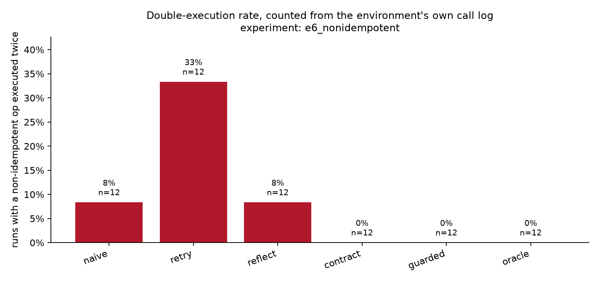
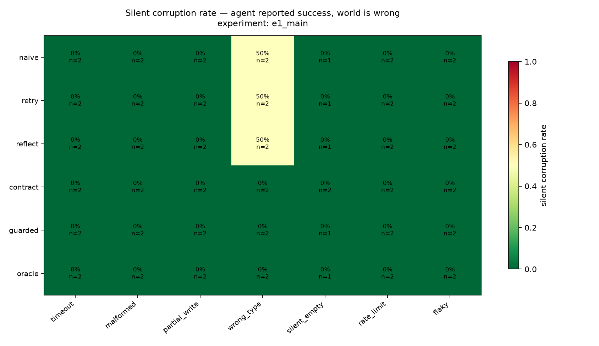

# chaosagent

**Chaos engineering for LLM agent loops.** A deterministic fault-injection harness that sits
between a tool-calling agent and its tools, injects eight classes of realistic failure at
controlled positions in a trajectory, and measures what the agent actually does about it.

[](https://github.com/Madhav-000-s/chaosagent/actions/workflows/ci.yml)
[](https://www.python.org/)
[](LICENSE)

Every agent benchmark runs in a world where tools return valid JSON, APIs stay up, and nothing
times out. Production has none of those properties, and the failure that matters isn't the crash —
it's **silent corruption**: the agent receives a truncated tool response, treats it as complete, and
confidently reports success while the system is in a wrong state.

Because the harness *causes* every fault, ground truth is free. The correct terminal state is known
by construction, so every metric is a state assertion rather than a human judgement.

---

## The findings

303 runs · 6 experiments · 1,511 LLM calls · Claude Haiku 4.5, Sonnet 5 and Opus 5.
All rates carry percentile-bootstrap 95% CIs. **The grids are small — read the intervals, not the
point estimates.** See [Limitations](docs/LIMITATIONS.md).

### 1. Blind retry — the framework default — double-charges customers

With a fault on `charge_payment` (n = 12 per config, Haiku 4.5):

| config | silent corruption | 95% CI | **double-execution** | invariants broken |
| --- | ---: | :---: | ---: | ---: |
| `retry` — blind retry ≤3× | **50%** | 12–88% | **33%** (4/12) | 4 |
| `naive` — no recovery | 12% | 0–38% | 8% (1/12) | 1 |
| `reflect` — reflection turn on error | 12% | 0–38% | 8% (1/12) | 1 |
| `contract` — typed error envelope | **0%** | 0–0% | **0%** | 0 |
| `guarded` — contract + key + verify read | **0%** | 0–0% | **0%** | 0 |
| `oracle` — told exactly what broke | **0%** | 0–0% | **0%** | 0 |

Double-execution is counted from the **environment's own call log**, not from the agent's trace.
That distinction is the measurement: under a dropped-response fault the agent's trace shows one
*failed* call while the world shows one *committed* write.

### 2. Reflection did not help. The interface did — for 5.8% more tokens

`reflect` is the widely-assumed fix. It performed **identically to `naive`** on every metric, at
3.2% higher token cost. The typed error envelope eliminated silent corruption entirely at 5.8%
higher token cost than `naive` — not the 3–4× that a reflection-style intervention is usually
argued to be worth.

| config | tokens/run | vs `naive` | silent corruption |
| --- | ---: | ---: | ---: |
| `naive` | 20,977 | — | 12% |
| `reflect` | 21,656 | +3.2% | 12% |
| `contract` | 22,184 | **+5.8%** | **0%** |

No configuration regressed on the zero-fault control arm — all six solve the task 100% of the time
with no faults present.

### 3. The frontier model didn't retry more carefully — it supplied the missing structure itself

The sharpest result, and not the one I expected. Under configurations where **nothing** asks for an
idempotency key (`naive`, `retry`, `reflect`), the optional `idempotency_key` tool argument was
populated:

| model | unprompted key use | double-execution under blind retry |
| --- | ---: | ---: |
| Claude Haiku 4.5 | **0 / 6** runs | 2 / 2 |
| Claude Sonnet 5 | **0 / 6** runs | 2 / 2 |
| Claude Opus 5 | **6 / 6** runs | **0 / 2** |

Opus 5 avoided the double charge not by retrying more carefully — the retry is mechanical, in the
harness, and fires identically for every model — but because it was the only model that reached for
the safety mechanism the tool schema exposed. Below the frontier, the interface had to supply it.

**Capability did not substitute for structure. At the frontier, capability *became* structure.**

---

## The three artifacts

| | |
| --- | --- |
|  |  |
| **Double-execution rate**, one bar per configuration. | **Silent-corruption heatmap**, config × fault class. |

Regenerate every figure, table and the [2-page write-up](results/chaosagent-writeup.pdf) from the
released trace database, with no API key:

```bash
chaosagent report --db traces/released/chaosagent.duckdb --out results/
python analysis/writeup.py --db traces/released/chaosagent.duckdb
```

---

## What made the numbers trustworthy — and what nearly didn't

Two bugs were found by running the harness, not by reading it. Both are fixed, both have regression
tests, and both are worth stating because they changed a headline number.

**The double-execution metric was over-counting.** `env_executed` was derived from whether the call
*succeeded*. An idempotency-key replay succeeds and returns the original payload while executing
nothing — so the metric invented executions that never happened, precisely for the configurations
that got idempotency *right*. It now reads the environment's own log. Fixing it is what revealed
finding #3: Opus 5's retries had never actually double-charged.

**Random-position injection dilutes the signal.** The main grid injects at a uniformly random
position, and most random positions land on a *recoverable* call — cancelling an already-cancelled
order is harmless. Silent corruption came out near zero across every configuration. That is a real
result about random-position injection, and it is reported as one, but it is not the interesting
question. The experiments above use the design's other schedule — *single, targeted at a specific
tool* — aimed at `charge_payment`, and answer the conditional: **given that a fault hits a
non-idempotent write, what does each configuration do?**

The generalisable point: **a fault-injection result is only as meaningful as the call the fault
landed on.** Production incidents are not uniformly distributed over your call graph either.

Related, and reported as a first-class column: `stale` landed on **0 of 12** attempts in the main
grid. It applies only to reads and needs a read that occurs *after* a write; these agents front-load
their reads. It is therefore effectively unmeasured, and claims about verification reads are
correspondingly weak.

---

## Quickstart

```bash
git clone https://github.com/Madhav-000-s/chaosagent && cd chaosagent
uv venv && uv pip install -e ".[dev,run,analysis]"
```

Everything below runs **without an API key**:

```bash
chaosagent validate                 # reference-solve all 50 tasks — the correctness gate
chaosagent tools                    # the 14-tool surface and its safety metadata
chaosagent faults                   # the fault taxonomy and what each one does to the world
chaosagent configs                  # the 8 agent configurations as a decomposition table
chaosagent report --db traces/released/chaosagent.duckdb --out results/
pytest                              # 287 tests, no network
```

To run agents live, put your key in `.env` (see [`.env.example`](.env.example)):

```bash
chaosagent run --config guarded --fault partial_write --target tool:charge_payment
chaosagent sweep experiments/e6_nonidempotent.yaml
chaosagent replay <run-id>          # what executed vs. what the agent saw
```

Every sweep is **resumable** (run ids are content hashes) and **cost-bounded** (a cumulative USD
ceiling aborts the sweep, not the process, leaving the partial grid analysable).

---

## Point it at your own agent

The environment and fault injector are a reusable harness. `FaultyEnvironment` exposes the same
surface as the environment, so any agent that can call tools can be measured:

```python
from chaosagent.env import Environment
from chaosagent.faults import FaultInjector, FaultSpec
from chaosagent.tasks import default_task_set

task = default_task_set().by_id("place_and_charge_01")
env = Environment(seed=1, init_state=task.init_state)
faulty = FaultInjector(
    FaultSpec(fault_class="partial_write", target="tool:charge_payment"),
    seed=1, trajectory_hint=task.min_calls,
).wrap(env)

your_agent.run(task.prompt, tools=faulty)          # faulty.call(tool, args) -> ToolResult

print("state correct:", task.expected_terminal.holds(env.state()))
print("what actually executed:", [c for c in env.call_log() if c.executed])
```

---

## How it works

```
CLI (Typer) ── ORCHESTRATOR ── RUNNER ─┬─ AGENT (config) ── LLM client (cached)
                                       └─ FAULT INJECTOR ── ENVIRONMENT (SQLite)
                                                   │
                              TRACE STORE (DuckDB) ┴─ SCORER ── REPORT
```

**The environment** is an order/fulfilment world: 14 tools, 5 state invariants, snapshot/restore,
and a virtual clock so `timeout` faults are *injected* rather than waited for. It is a pure function
of `(seed, action sequence)` — tested over 100 repetitions.

The write tools deliberately **do not deduplicate themselves**. `charge_payment` on a paid order
charges it again, exactly as a real payment gateway does. If preconditions rejected the repeat there
would be no double charge to measure. Safety comes from idempotency keys — the mechanism under test.

**The fault injector** is middleware below the agent's tool interface. Eight classes over four
outcome types, and the taxonomy is the whole design:

| outcome | world executed | agent sees | classes |
| --- | :---: | --- | --- |
| `suppress` | **yes** | an error | `partial_write`, post-commit `timeout` |
| `block` | no | an error | pre-commit `timeout` |
| `corrupt` | **yes** | a bad payload | `stale`, `malformed`, `wrong_type`, `silent_empty` |
| `delay` | eventually | *n* errors, then success | `flaky`, `rate_limit` |

The `suppress` row is the trap. Both `timeout` variants emit **byte-identical envelopes** — if the
pre-commit one said "nothing happened", the agent could read ground truth off the error and the
guarded config's advantage would be an artefact. Full details in
[`docs/FAULT_TAXONOMY.md`](docs/FAULT_TAXONOMY.md).

**The eight configurations** share one ReAct loop and differ only in three injected objects, which
is what makes the guard decomposition honest — no arm gets an incidental advantage from a
differently-written loop:

| config | error format | retry | reflect | contract | verify read | idem. key |
| --- | --- | :---: | :---: | :---: | :---: | :---: |
| `naive` | raw string | | | | | |
| `retry` | raw string | 3× | | | | |
| `reflect` | raw string | | ✓ | | | |
| `contract` | typed envelope | | | ✓ | | |
| `contract+idem` | typed envelope | | | ✓ | | ✓ |
| `contract+verify` | typed envelope | | | ✓ | ✓ | |
| `guarded` | typed envelope | | | ✓ | ✓ | ✓ |
| `oracle` | envelope + disclosure | | | ✓ | | ✓ |

**Fault transparency is a tested invariant.** No fault metadata reaches agent-visible content — the
visible error-code vocabulary is shared between real and injected failures, injection detail never
appears in a payload, and a control run is byte-identical to an unwrapped environment. `oracle` is
the deliberate exception, exempted at the agent layer rather than by relaxing the injector.

---

## Reproducibility

- **Every figure** regenerates from `chaosagent report`.
- **Every number** traces to a documented SQL query in [`chaosagent/metrics/queries/`](chaosagent/metrics/queries/).
- **The trace database and the 628-entry response cache are released**, so results re-derive with
  zero API spend. Verified: with `ANTHROPIC_API_KEY` empty, all 72 runs of E6 replay offline.

```bash
ANTHROPIC_API_KEY= CHAOSAGENT_CACHE_DIR=traces/released/cache \
  chaosagent sweep experiments/e6_nonidempotent.yaml --offline
```

Re-deriving the entire grid after both bug fixes cost **$0.33** — 97% cache hits. That is the
replay layer paying for itself, and it is why a metric bug costs a re-score rather than a re-run.

The environment, task set and injector are fully deterministic. **The model is not** — no sampling
parameters are sent at all (`temperature` is rejected outright by Sonnet 5 and Opus 5, and never
guaranteed identical outputs anyway). Reproducibility is the cache's job.

---

## Experiments

| | question | schedule | runs |
| --- | --- | --- | ---: |
| [`e1_main`](experiments/e1_main.yaml) | the main grid → heatmap | random position | 108 |
| [`e2_position`](experiments/e2_position.yaml) | does *where* the fault lands matter? | early / mid / late | 36 |
| [`e3_decomposition`](experiments/e3_decomposition.yaml) | which mechanism does the work? | `tool:charge_payment` | 51 |
| [`e4_models`](experiments/e4_models.yaml) | does capability substitute for structure? | `tool:charge_payment` | 24 |
| [`e5_rate`](experiments/e5_rate.yaml) | does the gap widen with fault density? | stochastic, p ∈ {.05,.15,.3} | 12 |
| [`e6_nonidempotent`](experiments/e6_nonidempotent.yaml) | the non-idempotent write, isolated | `tool:charge_payment` | 72 |

Full per-experiment tables in [`results/`](results/). The guard decomposition (E3) found **all four
arms at 0%** — the typed contract alone saturated, and the idempotency key and verification read
added nothing measurable on top of it at this sample size.

The spec's full-width grid ([`e1_main_full.yaml`](experiments/e1_main_full.yaml), 8,100 runs, ~$250)
is committed and runnable; the shipped defaults are reduced to fit a **$10 budget**.

---

## Tech stack

Python 3.11+ · Pydantic · asyncio · SQLite (environment) · DuckDB (traces) · NumPy/SciPy ·
matplotlib · Typer · pytest · `uv` · Anthropic API. **No agent framework** — the ReAct loop is ~200
lines and every branch is explainable, especially the retry logic.

~9,500 lines. 287 tests, no network, running in 4.5 s.

---

## Repo layout

```
chaosagent/
├── env/          SQLite world · 14 tools · 5 invariants · snapshot/restore · virtual clock
├── tasks/        8 templates → 50 tasks · reference solver · state assertions
├── faults/       8 fault classes · 4 outcome types · 4 schedules
├── agents/       one ReAct loop · 8 configurations · 3 strategy objects
├── runtime/      cached LLM client · DuckDB traces · budgets · async orchestrator
└── metrics/      10 documented SQL metrics · bootstrap CIs · report generation
experiments/      e1–e6 as declarative yaml
analysis/         supporting figures
results/          generated tables and figures
traces/released/  trace DB + response cache — reproduce with no API key
docs/             DESIGN · FAULT_TAXONOMY · LIMITATIONS
tests/            10 test files, 287 tests
```

---

## Limitations

Read [`docs/LIMITATIONS.md`](docs/LIMITATIONS.md) before citing any number. The headline ones:

- **Small grids.** Cell counts are often single digits and several confidence intervals are wide
  enough that adjacent configurations are indistinguishable. Where an interval straddles zero, the
  honest reading is "this grid cannot tell", not "no effect".
- **One synthetic environment.** The harness generalises; the numbers do not.
- **`stale` is effectively unmeasured** at random position (0/12 landings).
- **The model-tier comparison is confounded** — the three tiers do not accept the same request body,
  and thinking cannot be held fixed across them. Documented rather than hidden.
- **`oracle` is an optimistic upper bound.** It assumes perfect fault attribution, which no real
  system has.

---

## Deploying this idea

As a pre-merge regression gate: any change to an agent's tool layer or prompt runs the fault suite,
and silent-corruption rate becomes a tracked metric like latency. That reframes the project from
experiment to infrastructure — which is the point of shipping it as a harness rather than a paper.

## License

MIT — see [LICENSE](LICENSE). Task set provenance in [`datasheet.md`](datasheet.md).
