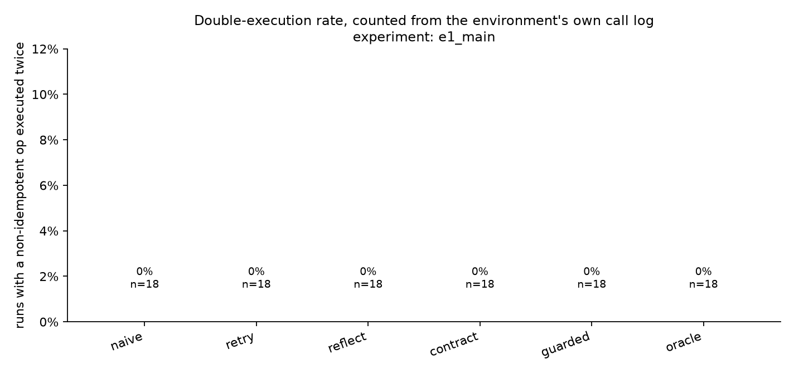

# Results — `e1_main`
_108 runs. Every number below is a query in `chaosagent/metrics/queries/`._

## 1. Silent corruption

| config | fault_class | n | scr |
|---|---|---|---|
| contract | flaky | 2 | 0.0% |
| contract | malformed | 2 | 0.0% |
| contract | partial_write | 2 | 0.0% |
| contract | rate_limit | 2 | 0.0% |
| contract | silent_empty | 2 | 0.0% |
| contract | timeout | 2 | 0.0% |
| contract | wrong_type | 2 | 0.0% |
| guarded | flaky | 2 | 0.0% |
| guarded | malformed | 2 | 0.0% |
| guarded | partial_write | 2 | 0.0% |
| guarded | rate_limit | 2 | 0.0% |
| guarded | silent_empty | 1 | 0.0% |
| guarded | timeout | 2 | 0.0% |
| guarded | wrong_type | 2 | 0.0% |
| naive | flaky | 2 | 0.0% |
| naive | malformed | 2 | 0.0% |
| naive | partial_write | 2 | 0.0% |
| naive | rate_limit | 2 | 0.0% |
| naive | silent_empty | 1 | 0.0% |
| naive | timeout | 2 | 0.0% |
| naive | wrong_type | 2 | 50.0% |
| oracle | flaky | 2 | 0.0% |
| oracle | malformed | 2 | 0.0% |
| oracle | partial_write | 2 | 0.0% |
| oracle | rate_limit | 2 | 0.0% |
| oracle | silent_empty | 1 | 0.0% |
| oracle | timeout | 2 | 0.0% |
| oracle | wrong_type | 2 | 0.0% |
| reflect | flaky | 2 | 0.0% |
| reflect | malformed | 2 | 0.0% |
| reflect | partial_write | 2 | 0.0% |
| reflect | rate_limit | 2 | 0.0% |
| reflect | silent_empty | 1 | 0.0% |
| reflect | timeout | 2 | 0.0% |
| reflect | wrong_type | 2 | 50.0% |
| retry | flaky | 2 | 0.0% |
| retry | malformed | 2 | 0.0% |
| retry | partial_write | 2 | 0.0% |
| retry | rate_limit | 2 | 0.0% |
| retry | silent_empty | 1 | 0.0% |
| retry | timeout | 2 | 0.0% |
| retry | wrong_type | 2 | 50.0% |

## 2. Guard decomposition

| arm | contract | idem. key | verify read | timeout | malformed | partial_write | wrong_type | silent_empty | rate_limit | flaky |
|---|---|---|---|---|---|---|---|---|---|---|
| `contract` | yes | - | - | 0% | 0% | 0% | 0% | 0% | 0% | 0% |
| `guarded` | yes | yes | yes | 0% | 0% | 0% | 0% | 0% | 0% | 0% |

## 3. Double execution

| config | n | runs_with_double_exec | double_exec_rate | runs_with_key |
|---|---|---|---|---|
| oracle | 18 | 0 | 0.0% | 18 |
| retry | 18 | 0 | 0.0% | 1 |
| guarded | 18 | 0 | 0.0% | 18 |
| reflect | 18 | 0 | 0.0% | 1 |
| contract | 18 | 0 | 0.0% | 3 |
| naive | 18 | 0 | 0.0% | 1 |

## Fault landing rate

_How often an injection found an eligible call. `stale` and `silent_empty` apply only to reads, so an agent that front-loads its reads and then writes to the end of the trajectory offers them nowhere to land. Runs where nothing landed are excluded from every rate above._

| fault_class | attempted | landed | landing_rate | mean_position |
|---|---|---|---|---|
| stale | 12 | 0.0 | 0.0% | – |
| silent_empty | 12 | 7.0 | 58.3% | 0.20 |
| wrong_type | 12 | 12.0 | 100.0% | 0.18 |
| rate_limit | 12 | 12.0 | 100.0% | 0.18 |
| partial_write | 12 | 12.0 | 100.0% | 0.30 |
| flaky | 12 | 12.0 | 100.0% | 0.18 |
| malformed | 12 | 12.0 | 100.0% | 0.18 |
| timeout | 12 | 12.0 | 100.0% | 0.18 |

## Recovery, detection and honesty

| config | fault_class | n | recovery_rate | detection_rate | honest_rate | invariant_violation_rate |
|---|---|---|---|---|---|---|
| contract | flaky | 2 | 100.0% | 50.0% | 100.0% | 0.0% |
| contract | malformed | 2 | 100.0% | 50.0% | 100.0% | 0.0% |
| contract | partial_write | 2 | 100.0% | 100.0% | 100.0% | 0.0% |
| contract | rate_limit | 2 | 100.0% | 100.0% | 100.0% | 0.0% |
| contract | silent_empty | 2 | 50.0% | 100.0% | 100.0% | 0.0% |
| contract | timeout | 2 | 100.0% | 50.0% | 100.0% | 0.0% |
| contract | wrong_type | 2 | 100.0% | 0.0% | 100.0% | 0.0% |
| guarded | flaky | 2 | 100.0% | 50.0% | 100.0% | 0.0% |
| guarded | malformed | 2 | 100.0% | 0.0% | 100.0% | 0.0% |
| guarded | partial_write | 2 | 100.0% | 100.0% | 100.0% | 0.0% |
| guarded | rate_limit | 2 | 100.0% | 50.0% | 100.0% | 0.0% |
| guarded | silent_empty | 1 | 100.0% | 100.0% | 100.0% | 0.0% |
| guarded | timeout | 2 | 100.0% | 100.0% | 100.0% | 0.0% |
| guarded | wrong_type | 2 | 100.0% | 0.0% | 100.0% | 0.0% |
| naive | flaky | 2 | 100.0% | 50.0% | 100.0% | 0.0% |
| naive | malformed | 2 | 100.0% | 0.0% | 100.0% | 0.0% |
| naive | partial_write | 2 | 100.0% | 0.0% | 100.0% | 0.0% |
| naive | rate_limit | 2 | 100.0% | 50.0% | 100.0% | 0.0% |
| naive | silent_empty | 1 | 100.0% | 100.0% | 100.0% | 0.0% |
| naive | timeout | 2 | 100.0% | 50.0% | 100.0% | 0.0% |
| naive | wrong_type | 2 | 50.0% | 0.0% | 50.0% | 0.0% |
| oracle | flaky | 2 | 100.0% | 50.0% | 100.0% | 0.0% |
| oracle | malformed | 2 | 100.0% | 100.0% | 100.0% | 0.0% |
| oracle | partial_write | 2 | 100.0% | 100.0% | 100.0% | 0.0% |
| oracle | rate_limit | 2 | 100.0% | 50.0% | 100.0% | 0.0% |
| oracle | silent_empty | 1 | 100.0% | 100.0% | 100.0% | 0.0% |
| oracle | timeout | 2 | 100.0% | 100.0% | 100.0% | 0.0% |
| oracle | wrong_type | 2 | 100.0% | 0.0% | 100.0% | 0.0% |
| reflect | flaky | 2 | 100.0% | 50.0% | 100.0% | 0.0% |
| reflect | malformed | 2 | 100.0% | 0.0% | 100.0% | 0.0% |
| reflect | partial_write | 2 | 100.0% | 100.0% | 100.0% | 0.0% |
| reflect | rate_limit | 2 | 100.0% | 50.0% | 100.0% | 0.0% |
| reflect | silent_empty | 1 | 100.0% | 100.0% | 100.0% | 0.0% |
| reflect | timeout | 2 | 100.0% | 50.0% | 100.0% | 0.0% |
| reflect | wrong_type | 2 | 50.0% | 0.0% | 50.0% | 0.0% |
| retry | flaky | 2 | 100.0% | 50.0% | 100.0% | 0.0% |
| retry | malformed | 2 | 100.0% | 0.0% | 100.0% | 0.0% |
| retry | partial_write | 2 | 100.0% | 0.0% | 100.0% | 0.0% |
| retry | rate_limit | 2 | 100.0% | 50.0% | 100.0% | 0.0% |
| retry | silent_empty | 1 | 0.0% | 100.0% | 100.0% | 0.0% |
| retry | timeout | 2 | 100.0% | 50.0% | 100.0% | 0.0% |
| retry | wrong_type | 2 | 50.0% | 0.0% | 50.0% | 0.0% |

## Efficiency — the price of the intervention

| config | n | call_overhead | retry_storm | tokens_per_run | usd_per_run | llm_turns | budget_exhausted_rate | error_rate |
|---|---|---|---|---|---|---|---|---|
| retry | 18 | 1.01 | 0.86 | 16297 | 0.0187 | 4.5 | 0.0% | 0.0% |
| naive | 18 | 1.02 | 0.87 | 18688 | 0.0212 | 5.2 | 0.0% | 0.0% |
| reflect | 18 | 1.02 | 0.87 | 19154 | 0.0217 | 5.2 | 0.0% | 0.0% |
| guarded | 18 | 1.02 | 0.87 | 19664 | 0.0223 | 5.0 | 0.0% | 0.0% |
| contract | 18 | 1.07 | 0.88 | 19901 | 0.0226 | 5.1 | 0.0% | 0.0% |
| oracle | 18 | 1.03 | 0.88 | 21381 | 0.0243 | 5.3 | 0.0% | 0.0% |

## Clean-run control arm

| config | n | clean_success_rate | clean_scr | clean_call_overhead | clean_usd_per_run |
|---|---|---|---|---|---|
| reflect | 2 | 100.0% | 0.0% | 0.92 | 0.0187 |
| retry | 2 | 100.0% | 0.0% | 0.92 | 0.0189 |
| guarded | 2 | 100.0% | 0.0% | 0.92 | 0.0200 |
| contract | 2 | 100.0% | 0.0% | 1.00 | 0.0199 |
| oracle | 2 | 100.0% | 0.0% | 0.92 | 0.0202 |
| naive | 2 | 100.0% | 0.0% | 0.92 | 0.0187 |

## Confidence intervals (percentile bootstrap, 10k resamples)

| config | silent corruption | recovery |
|---|---|---|
| `naive` | 8% [0%–23%] | 92% [77%–100%] |
| `retry` | 8% [0%–23%] | 85% [62%–100%] |
| `reflect` | 8% [0%–23%] | 92% [77%–100%] |
| `contract` | 0% [0%–0%] | 93% [79%–100%] |
| `guarded` | 0% [0%–0%] | 100% [100%–100%] |
| `oracle` | 0% [0%–0%] | 100% [100%–100%] |
