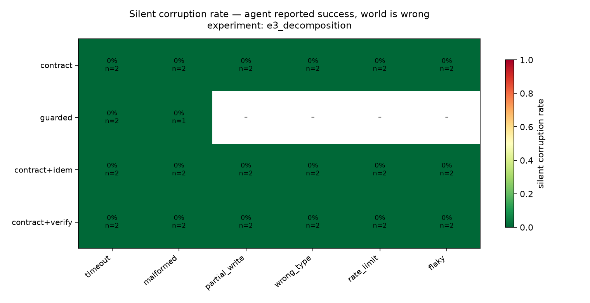
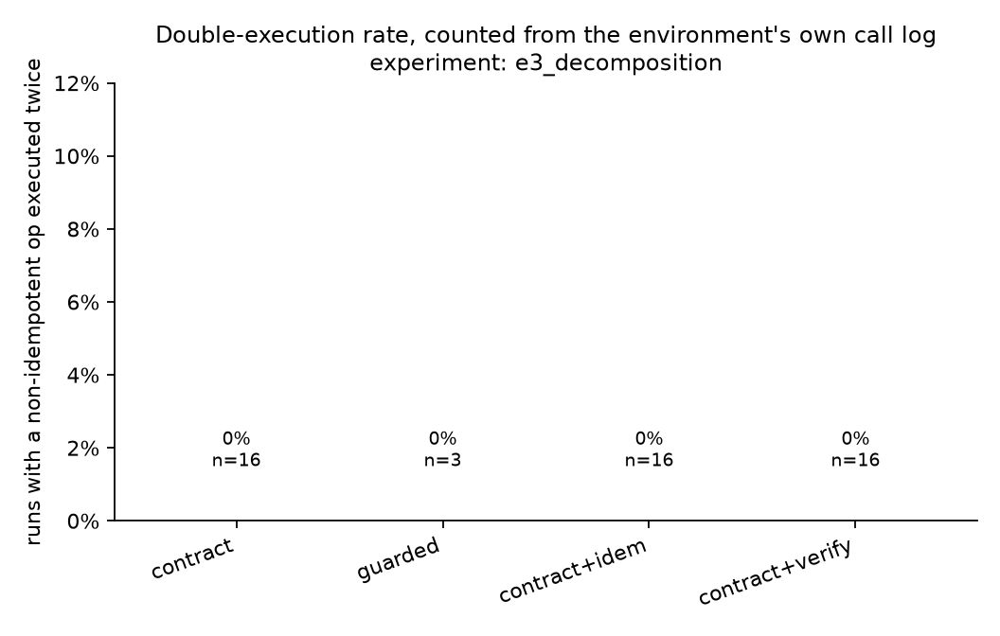

# Results — `e3_decomposition`
_51 runs. Every number below is a query in `chaosagent/metrics/queries/`._

## 1. Silent corruption

| config | fault_class | n | scr |
|---|---|---|---|
| contract | flaky | 2 | 0.0% |
| contract | malformed | 2 | 0.0% |
| contract | partial_write | 2 | 0.0% |
| contract | rate_limit | 2 | 0.0% |
| contract | timeout | 2 | 0.0% |
| contract | wrong_type | 2 | 0.0% |
| contract+idem | flaky | 2 | 0.0% |
| contract+idem | malformed | 2 | 0.0% |
| contract+idem | partial_write | 2 | 0.0% |
| contract+idem | rate_limit | 2 | 0.0% |
| contract+idem | timeout | 2 | 0.0% |
| contract+idem | wrong_type | 2 | 0.0% |
| contract+verify | flaky | 2 | 0.0% |
| contract+verify | malformed | 2 | 0.0% |
| contract+verify | partial_write | 2 | 0.0% |
| contract+verify | rate_limit | 2 | 0.0% |
| contract+verify | timeout | 2 | 0.0% |
| contract+verify | wrong_type | 2 | 0.0% |
| guarded | malformed | 1 | 0.0% |
| guarded | timeout | 2 | 0.0% |

## 2. Guard decomposition

| arm | contract | idem. key | verify read | timeout | malformed | partial_write | wrong_type | rate_limit | flaky |
|---|---|---|---|---|---|---|---|---|---|
| `contract` | yes | - | - | 0% | 0% | 0% | 0% | 0% | 0% |
| `contract+idem` | yes | yes | - | 0% | 0% | 0% | 0% | 0% | 0% |
| `contract+verify` | yes | - | yes | 0% | 0% | 0% | 0% | 0% | 0% |
| `guarded` | yes | yes | yes | 0% | 0% | – | – | – | – |

## 3. Double execution

| config | n | runs_with_double_exec | double_exec_rate | runs_with_key |
|---|---|---|---|---|
| contract | 16 | 0 | 0.0% | 3 |
| guarded | 3 | 0 | 0.0% | 3 |
| contract+idem | 16 | 0 | 0.0% | 16 |
| contract+verify | 16 | 0 | 0.0% | 3 |

## Fault landing rate

_How often an injection found an eligible call. `stale` and `silent_empty` apply only to reads, so an agent that front-loads its reads and then writes to the end of the trajectory offers them nowhere to land. Runs where nothing landed are excluded from every rate above._

| fault_class | attempted | landed | landing_rate | mean_position |
|---|---|---|---|---|
| silent_empty | 6 | 0.0 | 0.0% | – |
| stale | 6 | 0.0 | 0.0% | – |
| malformed | 7 | 7.0 | 100.0% | 0.81 |
| flaky | 6 | 6.0 | 100.0% | 0.82 |
| wrong_type | 6 | 6.0 | 100.0% | 0.82 |
| rate_limit | 6 | 6.0 | 100.0% | 0.82 |
| timeout | 8 | 8.0 | 100.0% | 0.80 |
| partial_write | 6 | 6.0 | 100.0% | 0.82 |

## Recovery, detection and honesty

| config | fault_class | n | recovery_rate | detection_rate | honest_rate | invariant_violation_rate |
|---|---|---|---|---|---|---|
| contract | flaky | 2 | 100.0% | 0.0% | 100.0% | 0.0% |
| contract | malformed | 2 | 100.0% | 50.0% | 100.0% | 0.0% |
| contract | partial_write | 2 | 100.0% | 100.0% | 100.0% | 0.0% |
| contract | rate_limit | 2 | 100.0% | 0.0% | 100.0% | 0.0% |
| contract | timeout | 2 | 100.0% | 100.0% | 100.0% | 0.0% |
| contract | wrong_type | 2 | 100.0% | 0.0% | 100.0% | 0.0% |
| contract+idem | flaky | 2 | 100.0% | 0.0% | 100.0% | 0.0% |
| contract+idem | malformed | 2 | 100.0% | 50.0% | 100.0% | 0.0% |
| contract+idem | partial_write | 2 | 100.0% | 100.0% | 100.0% | 0.0% |
| contract+idem | rate_limit | 2 | 100.0% | 0.0% | 100.0% | 0.0% |
| contract+idem | timeout | 2 | 100.0% | 100.0% | 100.0% | 0.0% |
| contract+idem | wrong_type | 2 | 100.0% | 0.0% | 100.0% | 0.0% |
| contract+verify | flaky | 2 | 100.0% | 0.0% | 100.0% | 0.0% |
| contract+verify | malformed | 2 | 100.0% | 50.0% | 100.0% | 0.0% |
| contract+verify | partial_write | 2 | 100.0% | 100.0% | 100.0% | 0.0% |
| contract+verify | rate_limit | 2 | 100.0% | 0.0% | 100.0% | 0.0% |
| contract+verify | timeout | 2 | 100.0% | 100.0% | 100.0% | 0.0% |
| contract+verify | wrong_type | 2 | 100.0% | 0.0% | 100.0% | 0.0% |
| guarded | malformed | 1 | 100.0% | 0.0% | 100.0% | 0.0% |
| guarded | timeout | 2 | 100.0% | 100.0% | 100.0% | 0.0% |

## Efficiency — the price of the intervention

| config | n | call_overhead | retry_storm | tokens_per_run | usd_per_run | llm_turns | budget_exhausted_rate | error_rate |
|---|---|---|---|---|---|---|---|---|
| guarded | 3 | 1.19 | 0.43 | 19066 | 0.0217 | 4.7 | 0.0% | 0.0% |
| contract+verify | 16 | 1.15 | 0.38 | 20352 | 0.0231 | 5.1 | 0.0% | 0.0% |
| contract+idem | 16 | 1.14 | 0.36 | 21226 | 0.0240 | 5.2 | 0.0% | 0.0% |
| contract | 16 | 1.14 | 0.36 | 21226 | 0.0240 | 5.2 | 0.0% | 0.0% |

## Clean-run control arm

_no rows_

## Confidence intervals (percentile bootstrap, 10k resamples)

| config | silent corruption | recovery |
|---|---|---|
| `contract` | 0% [0%–0%] | 100% [100%–100%] |
| `guarded` | 0% [0%–0%] | 100% [100%–100%] |
| `contract+idem` | 0% [0%–0%] | 100% [100%–100%] |
| `contract+verify` | 0% [0%–0%] | 100% [100%–100%] |
