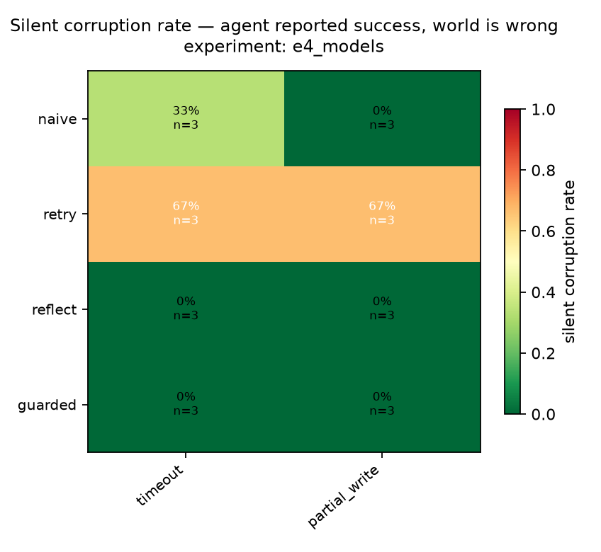
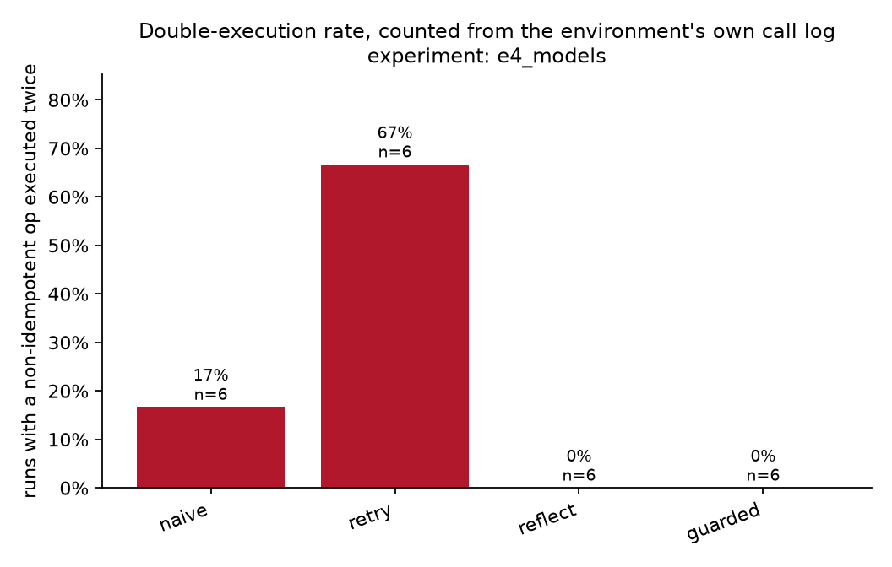

# Results — `e4_models`
_24 runs. Every number below is a query in `chaosagent/metrics/queries/`._

## 1. Silent corruption

| config | fault_class | n | scr |
|---|---|---|---|
| guarded | partial_write | 3 | 0.0% |
| guarded | timeout | 3 | 0.0% |
| naive | partial_write | 3 | 0.0% |
| naive | timeout | 3 | 33.3% |
| reflect | partial_write | 3 | 0.0% |
| reflect | timeout | 3 | 0.0% |
| retry | partial_write | 3 | 66.7% |
| retry | timeout | 3 | 66.7% |

## 2. Guard decomposition

| arm | contract | idem. key | verify read | timeout | partial_write |
|---|---|---|---|---|---|
| `guarded` | yes | yes | yes | 0% | 0% |

## 3. Double execution

| config | n | runs_with_double_exec | double_exec_rate | runs_with_key |
|---|---|---|---|---|
| retry | 6 | 4 | 66.7% | 2 |
| naive | 6 | 1 | 16.7% | 2 |
| guarded | 6 | 0 | 0.0% | 6 |
| reflect | 6 | 0 | 0.0% | 2 |

## Fault landing rate

_How often an injection found an eligible call. `stale` and `silent_empty` apply only to reads, so an agent that front-loads its reads and then writes to the end of the trajectory offers them nowhere to land. Runs where nothing landed are excluded from every rate above._

| fault_class | attempted | landed | landing_rate | mean_position |
|---|---|---|---|---|
| partial_write | 12 | 12.0 | 100.0% | 0.80 |
| timeout | 12 | 12.0 | 100.0% | 0.80 |

## Recovery, detection and honesty

| config | fault_class | n | recovery_rate | detection_rate | honest_rate | invariant_violation_rate |
|---|---|---|---|---|---|---|
| guarded | partial_write | 3 | 100.0% | 100.0% | 100.0% | 0.0% |
| guarded | timeout | 3 | 100.0% | 100.0% | 100.0% | 0.0% |
| naive | partial_write | 3 | 100.0% | 100.0% | 100.0% | 0.0% |
| naive | timeout | 3 | 66.7% | 100.0% | 66.7% | 33.3% |
| reflect | partial_write | 3 | 100.0% | 100.0% | 100.0% | 0.0% |
| reflect | timeout | 3 | 100.0% | 100.0% | 100.0% | 0.0% |
| retry | partial_write | 3 | 33.3% | 33.3% | 33.3% | 66.7% |
| retry | timeout | 3 | 33.3% | 33.3% | 33.3% | 66.7% |

## Efficiency — the price of the intervention

| config | n | call_overhead | retry_storm | tokens_per_run | usd_per_run | llm_turns | budget_exhausted_rate | error_rate |
|---|---|---|---|---|---|---|---|---|
| guarded | 6 | 1.27 | 0.47 | 20662 | 0.0707 | 4.7 | 0.0% | 0.0% |
| naive | 6 | 1.30 | 0.50 | 23698 | 0.0813 | 5.7 | 0.0% | 0.0% |
| retry | 6 | 1.40 | 0.60 | 22806 | 0.0817 | 5.3 | 0.0% | 0.0% |
| reflect | 6 | 1.27 | 0.47 | 25332 | 0.0840 | 6.0 | 0.0% | 0.0% |

## Clean-run control arm

_no rows_

## Confidence intervals (percentile bootstrap, 10k resamples)

| config | silent corruption | recovery |
|---|---|---|
| `naive` | 17% [0%–50%] | 83% [50%–100%] |
| `retry` | 67% [33%–100%] | 33% [0%–67%] |
| `reflect` | 0% [0%–0%] | 100% [100%–100%] |
| `guarded` | 0% [0%–0%] | 100% [100%–100%] |
