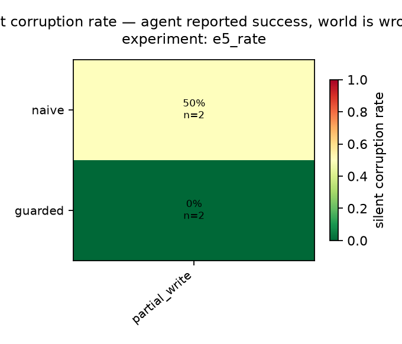
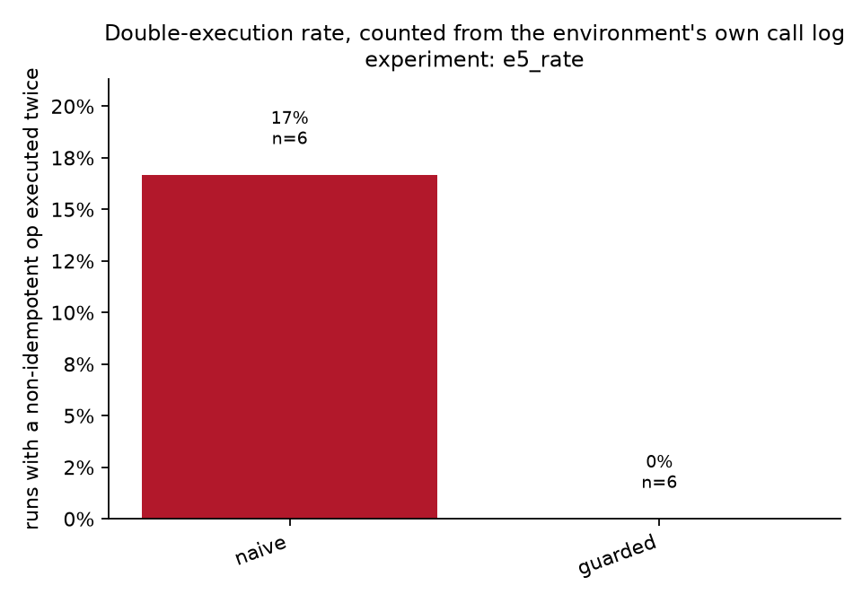

# Results — `e5_rate`
_12 runs. Every number below is a query in `chaosagent/metrics/queries/`._

## 1. Silent corruption

| config | fault_class | n | scr |
|---|---|---|---|
| guarded | partial_write | 2 | 0.0% |
| naive | partial_write | 2 | 50.0% |

## 2. Guard decomposition

| arm | contract | idem. key | verify read | partial_write |
|---|---|---|---|---|
| `guarded` | yes | yes | yes | 0% |

## 3. Double execution

| config | n | runs_with_double_exec | double_exec_rate | runs_with_key |
|---|---|---|---|---|
| naive | 6 | 1 | 16.7% | 1 |
| guarded | 6 | 0 | 0.0% | 6 |

## Fault landing rate

_How often an injection found an eligible call. `stale` and `silent_empty` apply only to reads, so an agent that front-loads its reads and then writes to the end of the trajectory offers them nowhere to land. Runs where nothing landed are excluded from every rate above._

| fault_class | attempted | landed | landing_rate | mean_position |
|---|---|---|---|---|
| partial_write | 12 | 4.0 | 33.3% | 0.55 |

## Recovery, detection and honesty

| config | fault_class | n | recovery_rate | detection_rate | honest_rate | invariant_violation_rate |
|---|---|---|---|---|---|---|
| guarded | partial_write | 2 | 100.0% | 100.0% | 100.0% | 0.0% |
| naive | partial_write | 2 | 50.0% | 50.0% | 0.0% | 0.0% |

## Efficiency — the price of the intervention

| config | n | call_overhead | retry_storm | tokens_per_run | usd_per_run | llm_turns | budget_exhausted_rate | error_rate |
|---|---|---|---|---|---|---|---|---|
| guarded | 6 | 1.01 | 0.65 | 18462 | 0.0211 | 4.7 | 0.0% | 0.0% |
| naive | 6 | 1.01 | 0.65 | 18448 | 0.0211 | 5.0 | 0.0% | 0.0% |

## Clean-run control arm

_no rows_

## Confidence intervals (percentile bootstrap, 10k resamples)

| config | silent corruption | recovery |
|---|---|---|
| `naive` | 50% [0%–100%] | 50% [0%–100%] |
| `guarded` | 0% [0%–0%] | 100% [100%–100%] |
