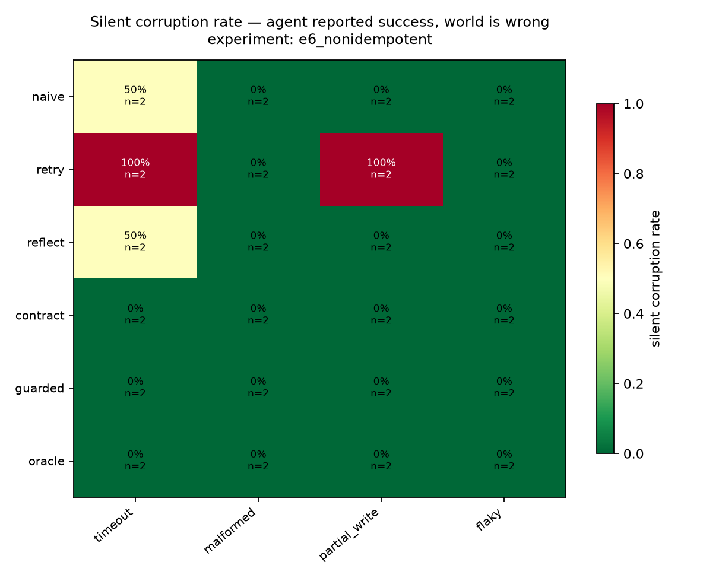

# Results — `e6_nonidempotent`
_72 runs. Every number below is a query in `chaosagent/metrics/queries/`._

## 1. Silent corruption

| config | fault_class | n | scr |
|---|---|---|---|
| contract | flaky | 2 | 0.0% |
| contract | malformed | 2 | 0.0% |
| contract | partial_write | 2 | 0.0% |
| contract | timeout | 2 | 0.0% |
| guarded | flaky | 2 | 0.0% |
| guarded | malformed | 2 | 0.0% |
| guarded | partial_write | 2 | 0.0% |
| guarded | timeout | 2 | 0.0% |
| naive | flaky | 2 | 0.0% |
| naive | malformed | 2 | 0.0% |
| naive | partial_write | 2 | 0.0% |
| naive | timeout | 2 | 50.0% |
| oracle | flaky | 2 | 0.0% |
| oracle | malformed | 2 | 0.0% |
| oracle | partial_write | 2 | 0.0% |
| oracle | timeout | 2 | 0.0% |
| reflect | flaky | 2 | 0.0% |
| reflect | malformed | 2 | 0.0% |
| reflect | partial_write | 2 | 0.0% |
| reflect | timeout | 2 | 50.0% |
| retry | flaky | 2 | 0.0% |
| retry | malformed | 2 | 0.0% |
| retry | partial_write | 2 | 100.0% |
| retry | timeout | 2 | 100.0% |

## 2. Guard decomposition

| arm | contract | idem. key | verify read | timeout | malformed | partial_write | flaky |
|---|---|---|---|---|---|---|---|
| `contract` | yes | - | - | 0% | 0% | 0% | 0% |
| `guarded` | yes | yes | yes | 0% | 0% | 0% | 0% |

## 3. Double execution

| config | n | runs_with_double_exec | double_exec_rate | runs_with_key |
|---|---|---|---|---|
| retry | 12 | 4 | 33.3% | 0 |
| reflect | 12 | 1 | 8.3% | 1 |
| naive | 12 | 1 | 8.3% | 0 |
| contract | 12 | 0 | 0.0% | 2 |
| guarded | 12 | 0 | 0.0% | 12 |
| oracle | 12 | 0 | 0.0% | 12 |

## Fault landing rate

_How often an injection found an eligible call. `stale` and `silent_empty` apply only to reads, so an agent that front-loads its reads and then writes to the end of the trajectory offers them nowhere to land. Runs where nothing landed are excluded from every rate above._

| fault_class | attempted | landed | landing_rate | mean_position |
|---|---|---|---|---|
| flaky | 18 | 12.0 | 66.7% | 0.75 |
| malformed | 18 | 12.0 | 66.7% | 0.75 |
| timeout | 18 | 12.0 | 66.7% | 0.75 |
| partial_write | 18 | 12.0 | 66.7% | 0.75 |

## Recovery, detection and honesty

| config | fault_class | n | recovery_rate | detection_rate | honest_rate | invariant_violation_rate |
|---|---|---|---|---|---|---|
| contract | flaky | 2 | 100.0% | 0.0% | 100.0% | 0.0% |
| contract | malformed | 2 | 100.0% | 50.0% | 100.0% | 0.0% |
| contract | partial_write | 2 | 100.0% | 100.0% | 100.0% | 0.0% |
| contract | timeout | 2 | 100.0% | 100.0% | 100.0% | 0.0% |
| guarded | flaky | 2 | 100.0% | 0.0% | 100.0% | 0.0% |
| guarded | malformed | 2 | 100.0% | 50.0% | 100.0% | 0.0% |
| guarded | partial_write | 2 | 100.0% | 100.0% | 100.0% | 0.0% |
| guarded | timeout | 2 | 100.0% | 100.0% | 100.0% | 0.0% |
| naive | flaky | 2 | 100.0% | 0.0% | 100.0% | 0.0% |
| naive | malformed | 2 | 100.0% | 50.0% | 100.0% | 0.0% |
| naive | partial_write | 2 | 100.0% | 100.0% | 100.0% | 0.0% |
| naive | timeout | 2 | 50.0% | 100.0% | 50.0% | 50.0% |
| oracle | flaky | 2 | 100.0% | 0.0% | 100.0% | 0.0% |
| oracle | malformed | 2 | 100.0% | 100.0% | 100.0% | 0.0% |
| oracle | partial_write | 2 | 100.0% | 100.0% | 100.0% | 0.0% |
| oracle | timeout | 2 | 100.0% | 100.0% | 100.0% | 0.0% |
| reflect | flaky | 2 | 100.0% | 0.0% | 100.0% | 0.0% |
| reflect | malformed | 2 | 100.0% | 50.0% | 100.0% | 0.0% |
| reflect | partial_write | 2 | 100.0% | 100.0% | 100.0% | 0.0% |
| reflect | timeout | 2 | 50.0% | 100.0% | 50.0% | 50.0% |
| retry | flaky | 2 | 100.0% | 0.0% | 100.0% | 0.0% |
| retry | malformed | 2 | 100.0% | 0.0% | 100.0% | 0.0% |
| retry | partial_write | 2 | 0.0% | 0.0% | 0.0% | 100.0% |
| retry | timeout | 2 | 0.0% | 0.0% | 0.0% | 100.0% |

## Efficiency — the price of the intervention

| config | n | call_overhead | retry_storm | tokens_per_run | usd_per_run | llm_turns | budget_exhausted_rate | error_rate |
|---|---|---|---|---|---|---|---|---|
| retry | 12 | 1.24 | 0.32 | 16975 | 0.0193 | 4.7 | 0.0% | 0.0% |
| naive | 12 | 1.13 | 0.46 | 20977 | 0.0236 | 5.6 | 0.0% | 0.0% |
| guarded | 12 | 1.11 | 0.43 | 21134 | 0.0238 | 5.2 | 0.0% | 0.0% |
| reflect | 12 | 1.12 | 0.45 | 21656 | 0.0244 | 5.7 | 0.0% | 0.0% |
| contract | 12 | 1.15 | 0.41 | 22184 | 0.0249 | 5.5 | 0.0% | 0.0% |
| oracle | 12 | 1.09 | 0.41 | 22405 | 0.0251 | 5.5 | 0.0% | 0.0% |

## Clean-run control arm

_no rows_

## Confidence intervals (percentile bootstrap, 10k resamples)

| config | silent corruption | recovery |
|---|---|---|
| `naive` | 12% [0%–38%] | 88% [62%–100%] |
| `retry` | 50% [12%–88%] | 50% [12%–88%] |
| `reflect` | 12% [0%–38%] | 88% [62%–100%] |
| `contract` | 0% [0%–0%] | 100% [100%–100%] |
| `guarded` | 0% [0%–0%] | 100% [100%–100%] |
| `oracle` | 0% [0%–0%] | 100% [100%–100%] |
